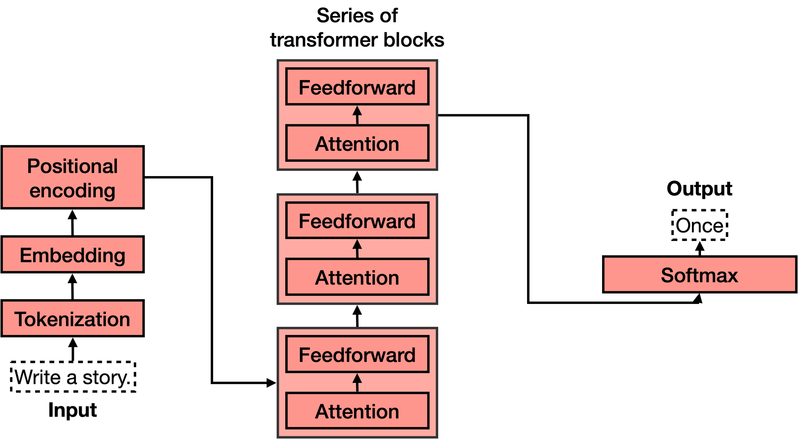

# 什么是Transformer模型并且他们的工作原理是什么？

长话短说：
Transformer 是机器学习领域的一项新发展，最近引起了很大轰动。 他们非常擅长跟踪上下文，这就是为什么他们写的文本有意义。 在这篇博文中，我们将介绍它们的架构及其工作原理。


Transformer 模型是机器学习中最激动人心的新发展之一。 它们是在论文 Attention is All You Need 中介绍的。 Transformer 可以用来写故事、散文、诗歌、回答问题、翻译语言、与人类聊天，甚至可以通过对人类来说很难的考试！ 但它们是什么？ 你会很高兴知道 transformer 模型的架构并不那么复杂，它只是一些非常有用的组件的串联，每个组件都有自己的功能。 在本文中，您将学习所有这些组件。

这篇博文包含一个简单的概念介绍。 如需更详细地描述Transformer 模型及其工作原理，请查看来自 Jay Alammar 的两篇优秀文章：

- [The illustrated transformer](https://jalammar.github.io/illustrated-transformer/?ref=txt.cohere.ai)
- [How GPT3 works](https://jalammar.github.io/how-gpt3-works-visualizations-animations/?ref=txt.cohere.ai)

简而言之，Transformer 的作用是什么？想象一下，您正在用手机写一条短信。 在每个单词之后，您可能会得到三个单词的建议。 例如，如果您输入“Hello, how are”，手机可能会建议下一个词，例如“you”或“your”。当然，如果你继续选择手机中的建议词，你很快就会发现这些词组成的信息毫无意义。如果你看 3 或 4 个连续的单词，它可能是有道理的，但这些单词并没有连接成任何有意义的东西。这是因为手机中使用的模型不包含消息的整体上下文，它只是预测哪个词更有可能出现在最后几个词之后。 另一方面，Transformer 会跟踪所写内容的上下文，这就是它们编写的文本有意义的原因。


我必须对你说实话，当我第一次发现变压器是一个字一个字地构建文本时，我无法相信它。首先，这不是人类形成句子和思想的方式。我们首先形成一个基本的思想，然后开始完善它并向它添加词语。这也不是ML模型做其他事情的方式。例如，图像就不是这样构建的。大多数基于神经网络的图形模型形成一个粗略的图像版本，然后慢慢完善它或添加细节，直到它变得完美。那么，为什么一个Transformer 模型会逐字建立文本呢？一个答案是，因为这样做效果非常好。一个更令人满意的答案是，因为Transformer 在跟踪上下文方面是如此令人难以置信的好，他们挑选的下一个词正是它所需要的，以继续推进一个想法。

那么Transformer 是如何训练的呢？通过大量的数据，事实上是互联网上的所有数据。因此，当你把 "你好，你好 "这句话输入转化器时，它只是知道，根据互联网上的所有文本，最好的下一个词是 "你"。如果你给它一个更复杂的命令，比如说，"写一个故事"，它可能会发现，一个好的下一个词是 "Once(曾经)"。然后它将这个词添加到命令中，并计算出下一个好的词是“upon”，(once upon的意思是“从前”)依此类推。一个字一个字地写下去，直到写成一个故事。

**Command:** Write a story.
**Response**: Once

**Next command:** Write a story. Once
**Response**: upon

**Next command:** Write a story. Once upon
**Response**: a

**Next command:** Write a story. Once upon a
**Response**: time

**Next command:** Write a story. Once upon a time
**Response**: there

etc.

现在我们知道了Transformer 的作用，让我们来看看它们的架构。如果你看过 Transformer 模型的架构，你可能会像我第一次看到它时那样惊叹不已，它看起来相当复杂！然而，当你把它分解成最重要的部分时，它并没有那么糟糕。Transformer 有4个主要部分：

1. Tokenization(标记化)
2. Embedding(嵌入)
3. Positional encoding(位置编码)
4. Transformer block (several of these)
5. Softmax(软最大)

第四个，Transformer 块，是最复杂的。 其中许多可以串联起来，每个都包含两个主要部分：attention 和前馈组件。



让我们一一研究这些部分。

# Tokenization

标记化是最基本的步骤。 它由一个大的标记数据集组成，包括所有单词、标点符号等。标记化步骤获取每个单词、前缀、后缀和标点符号，并将它们发送到库中的已知标记。


例如，如果句子是“Write a story”，那么对应的 4 个 token 将是

```html
<Write>, <a>, <story>, and <.>.
```


# Embedding

一旦输入被标记化，就该把单词变成数字了。为此，我们使用一个嵌入。嵌入是任何大型语言模型中最重要的部分之一；它是橡胶与道路的结合处。其原因是，它是将文本变成数字的桥梁。由于人类擅长处理文本，而计算机擅长处理数字，这座桥梁越强大，语言模型就越强大。

简而言之，文本嵌入将每段文本发送到一个数字向量（列表）。 如果两段文本相似，那么它们对应的向量中的数字彼此相似（从分量上来说，意味着相同位置的每对数字相似）。否则，如果两段文本不同，则它们对应的向量中的数字也不同。 如果您想了解更多信息，请查看这篇关于文本嵌入的[帖子](https://txt.cohere.ai/sentence-word-embeddings/)及其相应的[视频](https://www.youtube.com/watch?v=A8HEPBdKVMA&ref=txt.cohere.ai)。

尽管嵌入是数字的，但我喜欢用几何来想象它们。 想象一下，有一个非常简单的嵌入，它将每个单词发送到长度为 2 的向量（即 2 个数字的列表）。如果我们将每个词定位在这两个数字给出的坐标中（想象一下数字在一条街道和一条大道上的位置），那么我们就有所有的词站在一个大平面上。在这个平面上，相似的词出现在彼此之间，而不同的词则出现在彼此之间的远方。例如，在下面的嵌入中，樱桃的坐标是[6,4]，与草莓[5,4]很接近，但与城堡[1,2]很远。


在更大的嵌入的情况下，每个词被发送到一个更长的向量（例如，长度为 4096），那么这些词不再存在于二维平面中，而是存在于一个大的 4096 维空间中。然而，即使在这个大空间里，我们也可以认为词与词之间有近有远，所以嵌入的概念仍然有意义。

词嵌入泛化为文本嵌入，其中整个句子、段落甚至更长的文本被发送到一个向量。 然而，在 transformers 的情况下，我们将使用词嵌入，这意味着句子中的每个词都被发送到相应的向量。 更具体地说，输入文本中的每个标记都将被发送到嵌入中的相应向量。

例如，如果我们正在考虑的句子是“写一个故事”。 标记是 `<Write>`、`<a>`、`<story>` 和 `<.>`，然后这些标记中的每一个都将被发送到一个长向量，我们将有四个向量。


# Positional encoding

一旦我们有了句子中每个标记对应的向量，下一步就是将所有这些都变成一个向量来处理。将一堆向量变成一个向量的最常见方法是按分量相加。这意味着，我们分别相加每个坐标。例如，如果向量（长度为 2）为 [1,2] 和 [3,4]，则它们对应的总和为 [1+3, 2+4]，等于 [4, 6]。这可以奏效，但有一个小警告。加法是可交换的，这意味着如果你以不同的顺序添加相同的数字，你会得到相同的结果。在那种情况下，“I’m not sad, I’m happy” and the sentence “I’m not happy, I’m sad”, 会产生相同的向量，因为它们有相同的词，除了 以不同的顺序。这不太好。因此，我们必须想出一些方法，为这两个句子提供不同的向量。有几种方法可行，我们将采用其中一种：位置编码(positional encoding)。位置编码包括将一系列预定义向量添加到单词的嵌入向量中。这确保我们为每个句子获得一个唯一的向量，并且具有不同顺序的相同单词的句子将被分配不同的向量。在下面的示例中，对应于单词“Write”、“a”、“story”和“.”的向量。成为携带有关其位置信息的修改向量，标记为“Write (1)”、“a (2)”、“story (3)”和“. (4)”。


现在我们知道我们有一个对应于句子的唯一向量，并且这个向量包含句子中所有单词及其顺序的信息，我们可以进入下一步。

# Transformer block

让我们回顾一下到目前为止我们所拥有的。 单词进入并转化为标记（标记化），然后考虑顺序（位置编码）。这为我们输入到模型的每个标记提供了一个向量。现在，下一步是预测这句话中的下一个单词。这是通过一个非常非常大的神经网络完成的，该神经网络经过精确训练以预测句子中的下一个单词。

我们可以训练如此庞大的网络，但我们可以通过添加一个关键步骤来极大地改进它：attention 组件。在开创性论文[Attention is All you Need](https://arxiv.org/abs/1706.03762?ref=txt.cohere.com)中被介绍，它是 Transformer 模型的关键要素之一，也是它们运行良好的原因之一。下一节将解释Attention，但现在，将其想象成一种为文本中的每个单词添加上下文的方法。

在前馈网络的每个块中都添加了Attention组件。因此，如果你想象一个大型前馈神经网络，其目标是预测下一个单词，它由几个较小的神经网络块组成，那么每个块都会添加一个Attention组件。Transformer 的每个组件，称为Transformer 块，然后由两个主要组件组成：

Attention 组件.
前馈组件.

Transformer 是许多Transformer 块的串联。


# Attention

Attention这一步，处理一个非常重要的问题：上下文问题。如您所知，有时同一个词可以有不同的含义。这往往会混淆语言模型，因为嵌入只是将单词发送到向量，而不知道它们使用的是哪个单词的定义。

Attention 是一种非常有用的技术，可以帮助语言模型理解上下文。为了理解注意力是如何工作的，请考虑以下两个句子：

Sentence 1: The bank of the river.
Sentence 2: Money in the bank. 

如您所见，“银行”一词出现在两者中，但定义不同。在第一句中，我们指的是河边的土地，在第二句中指的是持有货币的机构。计算机对此一无所知，因此我们需要以某种方式将这些知识注入其中。什么可以帮我们？好吧，看起来句子中的其他词可以拯救我们。对于第一句话，“the”和“of”这两个词对我们没有用处。但是“river”这个词让我们知道我们在谈论河边的土地。同样，在句子 2 中，“Money ”一词帮助我们理解“bank”一词现在指的是持有货币的机构。


简而言之，Attention 的作用是将句子（或一段文本）中的词的词义更贴近句子中的其他词。这样，“Money in the bank”这句话中的“bank”就会离“money”更近一些。同样，在“The bank of the river”这句话中，“bank”这个词会被移近“river”这个词。这样，两个句子中的修饰词“bank”都会携带一些相邻词的信息，增加上下文。

Transformer 模型中使用的Attention 步骤实际上要强大得多，它被称为多头Attention 。在多头Attention 中，使用了几种不同的嵌入来修改向量并为其添加上下文。多头Attention 帮助语言模型在处理和生成文本时达到更高的效率水平。如果您想更详细地了解Attention 机制，请查看这篇博文([blog post](https://txt.cohere.com/what-is-attention-in-language-models/))及其相应的视频([video](https://www.youtube.com/watch?v=j10yrR6PPfg&pp=ygUoYXR0ZW50aW9uIG1lY2hhbmlzbXMgbHVpcyBzZXJyYW5vIGNvaGVyZQ%3D%3D&ref=txt.cohere.com))。

# The Softmax Layer

既然您已经知道 Transformer 由许多层 Transformer 块组成，每层都包含一个Attention 层和一个前馈层，您可以将其视为一个大型神经网络，用于预测句子中的下一个单词。Transformer 输出所有单词的分数，最有可能出现在句子中的单词会被给出最高的分数。

Transformer 的最后一步是 softmax 层，它将这些分数转化为概率（加起来为 1），其中最高分数对应于最高概率。然后，我们可以从这些概率中抽取下一个单词。在下面的示例中，Transformer 将 0.5 的最高概率提供给“Once”，将 0.3 和 0.2 的概率提供给“Somewhere”和“There”。一旦我们抽取，“Once”这个词就会被选中，这就是Transformer 的输出。


然后呢？好吧，我们重复这个步骤。我们现在输入文本“Write a story. Once“到模型，输出很可能是“upon”。一次又一次地重复这个步骤，Transformer 最终会写出一个故事，比如“从前，有一个……”。

# Summary

在这篇博文中，您了解了Transformer 的工作原理。它们由几个块组成，每个块都有自己的功能，它们一起工作以理解文本并生成下一个单词。 这些块如下：

**Tokenizer:** 把单词转变成tokens。

**Embedding:** 把tokens转变成数字(向量)。

**Positional encoding:** 为文本中的单词添加顺序。

**Transformer block:** 猜测下一个单词。 它由一个Attention 块和一个前馈块组成。
**Attention:** 为文本添加上下文。
**Feedforward:** 是Transformer 神经网络中的一个块，猜测下一个词。

**Softmax**: 将分数转化为概率，以便对下一个单词进行采样。

这些步骤的重复就是写出你所见过的Transformer 创造的惊人文本的原因。

# Post Training(训练后)

既然您知道transformers 是如何工作的，我们还有一些工作要做。想象一下：您作为transformers“What is the capital of Algeria?”。 我们希望它回答“Algiers”，然后继续前进。然而，transformer 是在整个互联网上训练的。互联网是一个很大的地方，它不一定是最好的问答库。例如，许多页面会有一长串没有答案的问题。在这种情况下，“What is the capital of Algeria?”之后的下一句 可能是另一个问题，例如“What is the population of Algeria?”，或“What is the capital of Burkina Faso?”。transformer 不是考虑这些响应的人，它只是模仿它在互联网上看到的（或已提供的任何数据集）。那么我们如何让transformer回答问题呢？

答案是训练后(post-training)。就像你教一个人完成某些任务一样，你可以让一个transformer 来执行任务。一旦在整个互联网上训练了一个transformer，它就会在一个大型数据集上再次训练，该数据集对应于许多问题及其各自的答案。transformer（与人类一样）对他们最近学到的东西有偏见，因此post-training已被证明是帮助transformer成功完成任务的非常有用的步骤。

Post-training还有助于完成许多其他任务。 例如，可以使用大型对话数据集对 Transformer 进行post-training，以帮助它作为聊天机器人表现良好，或者帮助我们编写故事、诗歌甚至代码。


参考：https://txt.cohere.com/what-are-transformer-models/