## 一、什么是WebFlux？

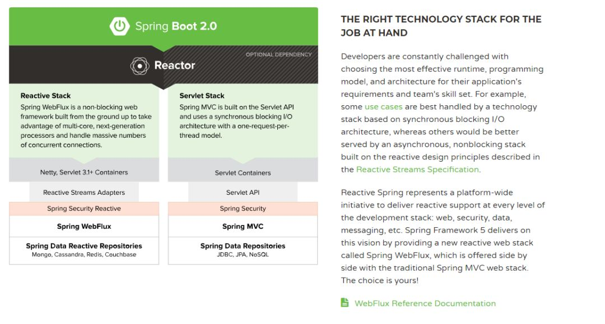

从官网的简介中我们能得出什么样的信息？

- 我们程序员往往**根据不同的应用场景选择不同的技术**，有的场景适合用于同步阻塞的，有的场景适合用于异步非阻塞的。而`Spring5`提供了一整套**响应式**(非阻塞)的技术栈供我们使用(包括Web控制器、权限控制、数据访问层等等)。
- 而左侧的图则是技术栈的对比啦；
- 响应式一般用Netty或者Servlet 3.1的容器(因为支持异步非阻塞)，而Servlet技术栈用的是Servlet容器
- 在Web端，响应式用的是WebFlux，Servlet用的是SpringMVC
- …..

总结起来，WebFlux只是响应式编程中的一部分(在Web控制端)，所以一般我们用它与SpringMVC来对比。

## 二、如何理解响应式编程？

在上面提到了**响应式编程**(Reactive Programming)，而WebFlux只是响应式编程的其中一个技术栈而已，所以我们先来探讨一下什么是响应式编程

从维基百科里边我们得到的定义：

> reactive programming is a declarative programming paradigm concerned with data streams and the propagation of change

响应式编程（reactive programming）是一种基于数据流（data stream）和变化传递（propagation of change）的声明式（declarative）的编程范式

在维基百科上也举了个小例子：

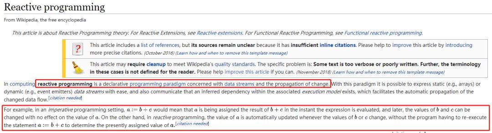例子

意思大概如下：

- 在命令式编程(我们的日常编程模式)下，式子`a=b+c`，这就意味着`a`的值是由`b`和`c`计算出来的。如果`b`或者`c`后续有变化，**不会影响**到`a`的值
- 在响应式编程下，式子`a:=b+c`，这就意味着`a`的值是由`b`和`c`计算出来的。但如果`b`或者`c`的值后续有变化，**会影响**到`a`的值

我认为上面的例子已经可以帮助我们理解**变化传递（propagation of change）**

那数据流（data stream）和声明式（declarative）怎么理解呢？那可以提一提我们的Stream流了。之前写过Lambda表达式和Stream流的文章，大家可以先去看看：

- [最近学到的Lambda表达式基础知识](https://mp.weixin.qq.com/s?__biz=MzI4Njg5MDA5NA==&mid=2247485692&idx=1&sn=a6b3f040b13fa2324992b11a927e34dc&chksm=ebd749fddca0c0eb1b05c08ede7ee4a44699584fbc0c3449ec2cac7642fd13819470ec7f44d8&token=1024331018&lang=zh_CN&scene=21#wechat_redirect)
- [手把手带你体验Stream流](https://mp.weixin.qq.com/s?__biz=MzI4Njg5MDA5NA==&mid=2247485861&idx=3&sn=9f4a83c8c75b43ead7b4ec187fe031ca&chksm=ebd748a4dca0c1b2d8a1b16656ada30c92bcb6e099c54e6b5b6eebbb29dc8914e1244e77c1e4&token=2052427710&lang=zh_CN&scene=21#wechat_redirect)

Lambda的语法是这样的(Stream流的使用会涉及到很多Lambda表达式的东西，所以一般先学Lambda再学Stream流)：

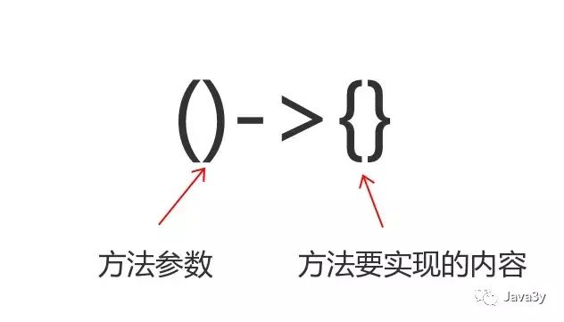

Stream流的使用分为三个步骤(创建Stream流、执行中间操作、执行最终操作)：

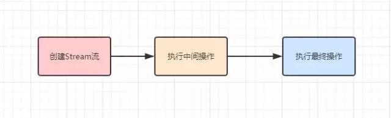

执行中间操作实际上就是给我们提供了很多的**API**去操作Stream流中的数据(**求和/去重/过滤**)等等

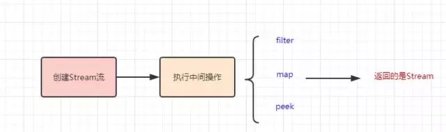

说了这么多，怎么理解数据流和声明式呢？其实是这样的：

- 本来数据是我们自行处理的，后来我们把要**处理的数据抽象出来**（变成了数据流），然后**通过API去处理**数据流中的数据（是声明式的）

比如下面的代码；将数组中的数据变成**数据流**，通过显式声明调用`.sum()`来处理数据流中的数据，得到最终的结果：

```java
public static void main(String[] args) {
    int[] nums = { 1, 2, 3 };
    int sum2 = IntStream.of(nums).parallel().sum();
    System.out.println("结果为：" + sum2);
}
```

如图下所示：

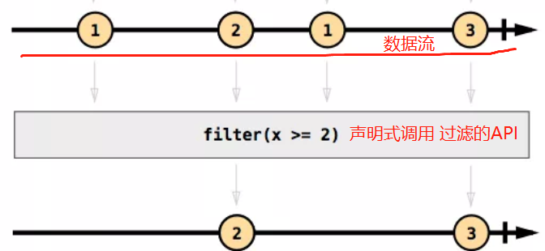

### 响应式编程->异步非阻塞

上面讲了响应式编程是什么：

> 响应式编程（reactive programming）是一种基于数据流（data stream）和变化传递（propagation of change）的声明式（declarative）的编程范式

也讲解了数据流/变化传递/声明式是什么意思，但说到响应式编程就离不开**异步非阻塞**。

从Spring官网介绍WebFlux的信息我们就可以发现`asynchronous, nonblocking` 这样的字样，因为**响应式编程它是异步**的，也可以理解成**变化传递**它是异步执行的。

如下图，**合计的金额会受其他的金额影响**(更新的过程是异步的)：

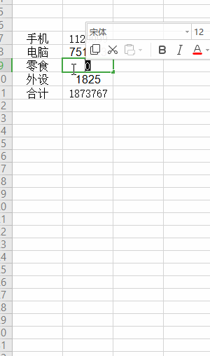

我们的JDK8 Stream流是同步的，它就不适合用于响应式编程（但基础的用法是需要懂的，因为响应式流编程都是操作**流**嘛）

而在JDK9 已经支持响应式流了，下面我们来看一下

## 三、JDK9 Reactive

响应式流的规范早已经被提出了：里面提到了：

响应式流的规范早已经被提出了：里面提到了：

> Reactive Streams is an initiative to provide a standard for asynchronous stream processing with non-blocking **back pressure**  ----->http://www.reactive-streams.org/

翻译再加点信息：

> 响应式流(Reactive Streams)通过定义一组实体，接口和互操作方法，给出了实现异步非阻塞**背压**的标准。第三方遵循这个标准来实现具体的解决方案，常见的有Reactor，RxJava，Akka Streams，Ratpack等。

规范里头实际上就是定义了四个接口：

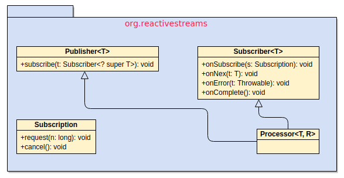

Java 平台直到 JDK 9才提供了对于Reactive的完整支持，JDK9也定义了上述提到的四个接口，在`java.util.concurrent`包上

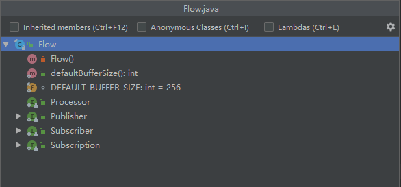

一个通用的流处理架构一般会是这样的（**生产者产生数据，对数据进行中间处理，消费者拿到数据消费**)：


- 数据来源，一般称为生产者（Producer）
- 数据的目的地，一般称为消费者(Consumer)
- 在处理时，对数据执行某些操作一个或多个处理阶段。（Processor)

到这里我们再看回响应式流的接口，我们应该就能懂了：

- Publisher（发布者)相当于生产者(Producer)
- Subscriber(订阅者)相当于消费者(Consumer)
- Processor就是在发布者与订阅者之间处理数据用的

在响应式流上提到了back pressure（背压)这么一个概念，其实非常好理解。在响应式流实现异步非阻塞是基于生产者和消费者模式的，而生产者消费者很容易出现的一个问题就是：**生产者生产数据多了，就把消费者给压垮了**。

而背压说白了就是：**消费者能告诉生产者自己需要多少量的数据**。这里就是**Subscription**接口所做的事。

下面我们来看看JDK9接口的方法，或许就更加能理解上面所说的话了：

```java
// 发布者(生产者)
public interface Publisher<T> {
    public void subscribe(Subscriber<? super T> s);
}
// 订阅者(消费者)
public interface Subscriber<T> {
    public void onSubscribe(Subscription s);
    public void onNext(T t);
    public void onError(Throwable t);
    public void onComplete();
}
// 用于发布者与订阅者之间的通信(实现背压：订阅者能够告诉生产者需要多少数据)
public interface Subscription {
    public void request(long n);
    public void cancel();
}
// 用于处理发布者 发布消息后，对消息进行处理，再交由消费者消费
public interface Processor<T,R> extends Subscriber<T>, Publisher<R> {
```

## 四、入门WebFlux

扯了一大堆，终于回到WebFlux了。经过上面的基础，我们现在已经能够得出一些结论的了：

- WebFlux是Spring推出响应式编程的一部分(web端)
- 响应式编程是异步非阻塞的(是一种基于数据流（data stream）和变化传递（propagation of change）的声明式（declarative）的编程范式)

我们再回来看官网的图：

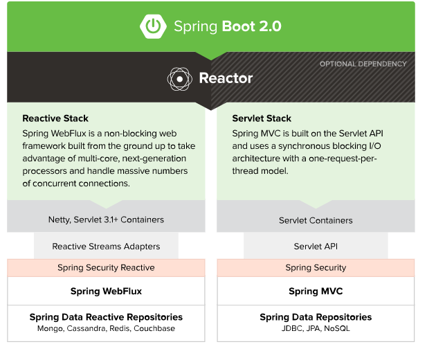

### 简单体验WebFlux

Spring官方为了让我们更加**快速/平滑**到WebFlux上，之前SpringMVC那套都是支持的。也就是说：**我们可以像使用SpringMVC一样使用着WebFlux**。

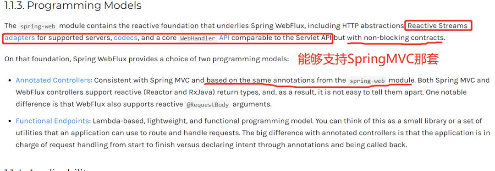

WebFlux使用的响应式流并不是用JDK9平台的，而是一个叫做**Reactor**响应式流库。所以，**入门**WebFlux其实更多是了解怎么使用Reactor的API，下面我们来看看~

Reactor是一个响应式流，它也有对应的发布者(`Publisher` )，Reactor的发布者用两个类来表示：

- **Mono**(返回0或1个元素)
- **Flux**(返回0-n个元素)

而消费者则是**Spring框架帮我们**去完成

下面我们来看一个简单的例子(基于WebFlux环境构建)：

```java
// 阻塞5秒钟
private String createStr() {
    try {
        TimeUnit.SECONDS.sleep(5);
    } catch (InterruptedException e) {
    }
    return "some string";
}

// 普通的SpringMVC方法
@GetMapping("/1")
private String get1() {
    log.info("get1 start");
    String result = createStr();
    log.info("get1 end.");
    return result;
}

// WebFlux(返回的是Mono)
@GetMapping("/2")
private Mono<String> get2() {
    log.info("get2 start");
    Mono<String> result = Mono.fromSupplier(() -> createStr());
    log.info("get2 end.");
    return result;
}
```

首先，值得说明的是，我们构建WebFlux环境启动时，应用服务器默认是Netty的：

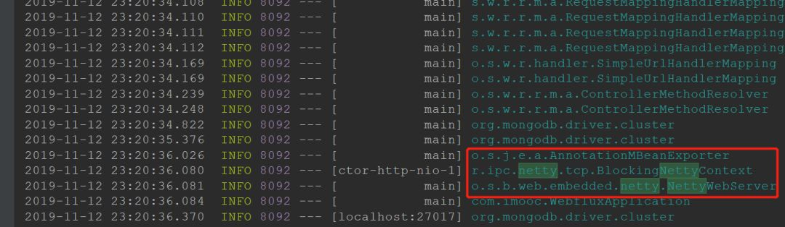

我们分别来访问一下SpringMVC的接口和WebFlux的接口，看一下有什么区别：

SpringMVC：

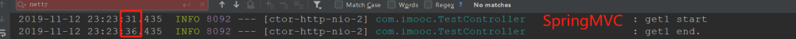

WebFlux：

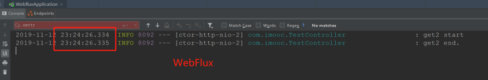

从调用者(浏览器)的角度而言，是感知不到有什么变化的，因为都是得等待5s才返回数据。但是，从服务端的日志我们可以看出，WebFlux是**直接返回Mono对象的**(而不是像SpringMVC一直同步阻塞5s，线程才返回)。

这正是WebFlux的好处：能够以**固定的线程来处理高并发**（充分发挥机器的性能）。

WebFlux还支持**服务器推送**(SSE - >Server Send Event)，我们来看个例子：

```java
/**
     * Flux : 返回0-n个元素
     * 注：需要指定MediaType
     * @return
     */
@GetMapping(value = "/3", produces = MediaType.TEXT_EVENT_STREAM_VALUE)
private Flux<String> flux() {
    Flux<String> result = Flux
        .fromStream(IntStream.range(1, 5).mapToObj(i -> {
            try {
                TimeUnit.SECONDS.sleep(1);
            } catch (InterruptedException e) {
            }
            return "flux data--" + i;
        }));
    return result;
}
```

效果就是**每秒**会给浏览器推送数据：

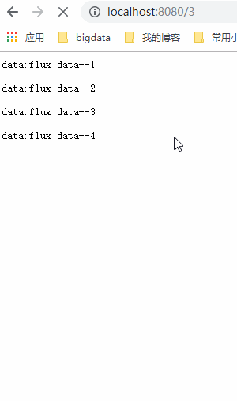服务器推送