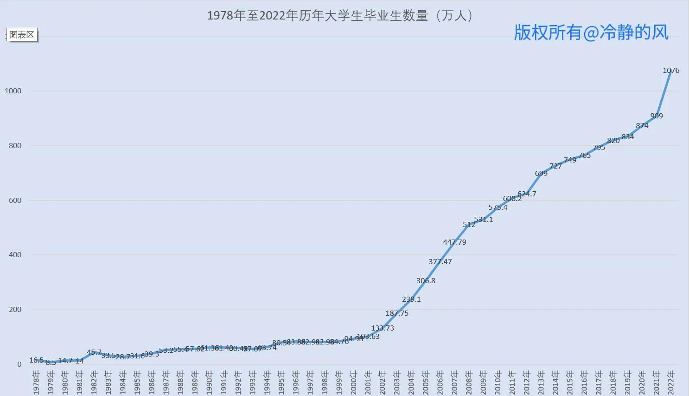
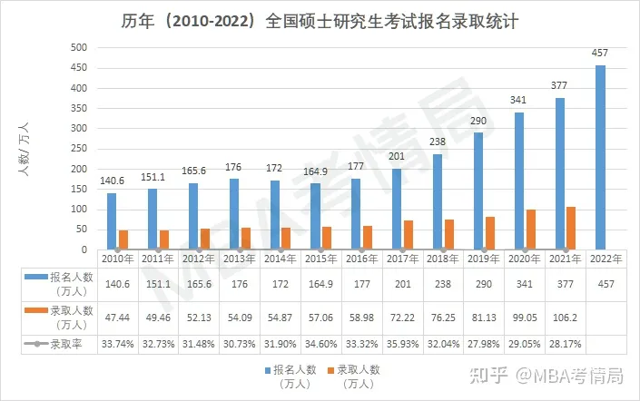

# 大学毕业生人数变化

https://www.toutiao.com/article/7108610766000996898/

https://www.shujujidi.com/jiaoyu/125.html

# 招生人数变化

| 序号 | 时间(年) | 参加高考人数(万人) | 高考录取人数(万人) | 高考录取率(%) | 招生高校数 |
| :--: | :------: | :----------------: | :----------------: | :-----------: | :--------: |
|      |   1950   |                    |        5.8         |               |            |
|      |   1951   |                    |        5.2         |               |            |
|      |   1952   |        7.3         |        6.64        |      91%      |            |
|      |   1953   |        9.0         |        7.0         |      77%      |            |
|      |   1954   |        13.4        |        9.38        |      70%      |            |
|      |   1955   |        17.7        |        9.8         |      60%      |            |
|      |   1956   |        35.0        |        18.5        |      48%      |            |
|      |   1957   |        25.2        |        10.6        |      48%      |            |
|      |   1958   |                    |        26.5        |     121%      |            |
|      |   1959   |        33.3        |        27.4        |      81%      |            |
|      |   1960   |        29.0        |        32.3        |    111.4%     |            |
|      |   1961   |        21.4        |        16.9        |      80%      |            |
|      |   1962   |        44.1        |        10.7        |     24.3%     |            |
|      |   1963   |        53.1        |        13.3        |      25%      |            |
|      |   1964   |        44.9        |        14.7        |      34%      |            |
|      |   1965   |        36.0        |        16.4        |     45.6%     |            |
|      |   1966   |                    |                    |               |            |
|      |   1967   |                    |                    |               |            |
|      |   1968   |                    |                    |               |            |
|      |   1969   |                    |                    |               |            |
|      |   1970   |                    |         9          |               |            |
|      |   1971   |                    |                    |               |            |
|      |   1972   |                    |         13         |               |            |
|      |   1973   |                    |        15.3        |               |            |
|      |   1974   |                    |        16.5        |               |            |
|      |   1975   |                    |         19         |               |            |
|      |   1976   |                    |                    |               |            |
|  1   |   1977   |        570         |        27.3        |      5%       |    404     |
|  2   |   1978   |        610         |        40.2        |      7%       |    598     |
|  3   |   1979   |        468         |         28         |      6%       |    633     |
|  4   |   1980   |        333         |         28         |      8%       |    675     |
|  5   |   1981   |        259         |         28         |      11%      |    704     |
|  6   |   1982   |        187         |         32         |      17%      |    715     |
|  7   |   1983   |        167         |         39         |      23%      |    805     |
|  8   |   1984   |        164         |         48         |      29%      |    902     |
|  9   |   1985   |        176         |         62         |      35%      |    1016    |
|  10  |   1986   |        191         |         57         |      30%      |    1054    |
|  11  |   1987   |        228         |         62         |      27%      |    1063    |
|  12  |   1988   |        272         |         67         |      25%      |    1075    |
|  13  |   1989   |        266         |         60         |      23%      |    1079    |
|  14  |   1990   |        283         |         61         |      22%      |    1075    |
|  15  |   1991   |        296         |         62         |      21%      |    1075    |
|  16  |   1992   |        303         |         75         |      25%      |    1053    |
|  17  |   1993   |        286         |         98         |      34%      |    1065    |
|  18  |   1994   |        251         |         90         |      36%      |    1080    |
|  19  |   1995   |        253         |         93         |      37%      |    1054    |
|  20  |   1996   |        241         |         97         |      40%      |    1032    |
|  21  |   1997   |        278         |        100         |      36%      |    1020    |
|  22  |   1998   |        320         |        108         |      34%      |    1022    |
|  23  |   1999   |        288         |        160         |      56%      |    1071    |
|  24  |   2000   |        375         |        221         |      59%      |    1041    |
|  25  |   2001   |        454         |        268         |      59%      |    1225    |
|  26  |   2002   |        510         |        320         |      63%      |    1396    |
|  27  |   2003   |        613         |        382         |      62%      |    1552    |
|  28  |   2004   |        729         |        447         |      61%      |    1731    |
|  29  |   2005   |        877         |        504         |      57%      |    1792    |
|  30  |   2006   |        950         |        546         |      57%      |    1867    |
|  31  |   2007   |        1010        |        566         |      56%      |    1908    |
|  32  |   2008   |        1050        |        599         |      57%      |    2263    |
|  33  |   2009   |        1020        |        629         |      62%      |    2305    |
|  34  |   2010   |        946         |        657         |      69%      |    2385    |
|  35  |   2011   |        933         |        675         |      72%      |    2487    |
|  36  |   2012   |        915         |        685         |      75%      |    2442    |
|  37  |   2013   |        912         |        684         |      75%      |    2622    |
|  38  |   2014   |        939         |        697         |     74.3%     |    2529    |
|  39  |   2015   |        942         |        700         |     74.3%     |    2553    |
|  40  |   2016   |        940         |        705         |      75%      |    2595    |
|  41  |   2017   |        940         |        700         |    74.46%     |    2631    |
|  42  |   2018   |        975         |       790.99       |    81.13%     |    2663    |
|  43  |   2019   |        1031        |        820         |    79.53%     |    2688    |
|  44  |   2020   |        1071        |        856         |    79.92%     |    2956    |
|  45  |   2021   |        1078        |      1001.32       |    92.89%     |            |
|  46  |   2022   |        1193        |                    |               |            |

http://114.xixik.com/gaokao/

http://m.news.xixik.com/content/4135b07c0b82afff/

# 新出生人口变化

1949年：1391万

1950年：1471万

1951年：1441万

1952年：1724万

1953年：1675万

1954年：1851万

1955年：1861万

1956年：1736万

1957年：1900万

1958年：1714万

1959年：1306万

1960年：1468万

1961年：1141万

1962年：2092万

1963年：2787万

1964年：2414万

1965年：2480万

1966年：2483万

1967年：2174万

1968年：2772万

1969年：2502万

1970年：2801万

1971年：2516万

1972年：2480万

1973年：2491万

1974年：2255万

1975年：2126万

1976年：1866万

1977年：1798万

1978年：1757万

1979年：1738万

1980年：1797万

1981年：2092万

1982年：2265万

1983年：2080万

1984年：2077万

1985年：2227万

1986年：2411万

1987年：2550万

1988年：2307万

1989年：2432万

1990年：2391万

1991年：2258万

1992年：2119万

1993年：2126万

1994年：2104万

1995年：2063万

1996年：2067万

1997年：2038万

1998年：1991万

1999年：1909万

2000年：1771万

2001年：1702万

2002年：1647万

2003年：1599万

2004年：1593万

2005年：1617万

2006年：1584万

2007年：1594万

2008年：1608万

2009年：1615万

2010年：1588万

2011年：1604万

2012年：1635万

2013年：1640万

2014年：1687万

2015年：1655万

2016年：1786万

2017年：1723万

2018年：1523万

2019年：1465万

2020年：1202万

2021年：1062万

2022年：956万

# 研究生毕业人数变化

| 时间   | 研究生毕业人数 |
| :----- | :------------- |
| 2021年 | 772761         |
| 2020年 | 728627         |
| 2019年 | 639666         |
| 2018年 | 604368         |
| 2017年 | 578045         |
| 2016年 | 563938         |
| 2015年 | 551522         |
| 2014年 | 535863         |
| 2013年 | 513626         |
| 2012年 | 486455         |
| 2011年 | 429994         |
| 2010年 | 383600         |
| 2009年 | 371273         |
| 2008年 | 344825         |
| 2007年 | 311839         |
| 2006年 | 255902         |
| 2005年 | 189728         |
| 2004年 | 150777         |
| 2003年 | 111091         |
| 2002年 | 80841          |

https://m.shujujidi.com/jiaoyu/118.html

https://baijiahao.baidu.com/s?id=1744021425029011052&wfr=spider&for=pc

# 研究生招生人数变化

| 年份 | 报名人数（万） | 增长率 | 录取人数 | 报录比 |
| ---- | -------------- | ------ | -------- | ------ |
| 2022 | 457            | /      | /        | /      |
| 2021 | 377            | 10.56% | /        | /      |
| 2020 | 341            | 17.59% | 99.05万  | 3.4:1  |
| 2019 | 290            | 21.8%  | 81.13万  | 3.6：1 |
| 2018 | 238            | 18.4%  | 76.25万  | 3.1:1  |
| 2017 | 201            | 13.56% | 72.22万  | 2.9:1  |
| 2016 | 177            | 7.3%   | 589800   | 3.0:1  |
| 2015 | 164.9          | -4.12% | 570600   | 2.9:1  |
| 2014 | 172            | -2.27% | 548700   | 3.1:1  |
| 2013 | 176            | 6.3%   | 540900   | 3.3:1  |
| 2012 | 165.6          | 9.6%   | 521300   | 3.2:1  |
| 2011 | 151.1          | 7.5%   | 494600   | 3.1:1  |
| 2010 | 140.6          | 12.8%  | 474400   | 3.0:1  |

https://www.gaodun.com/kaoyan/1257205.html

https://www.chinakaoyan.com/info/article/id/378907.shtml

https://baijiahao.baidu.com/s?id=1744021425029011052&wfr=spider&for=pc