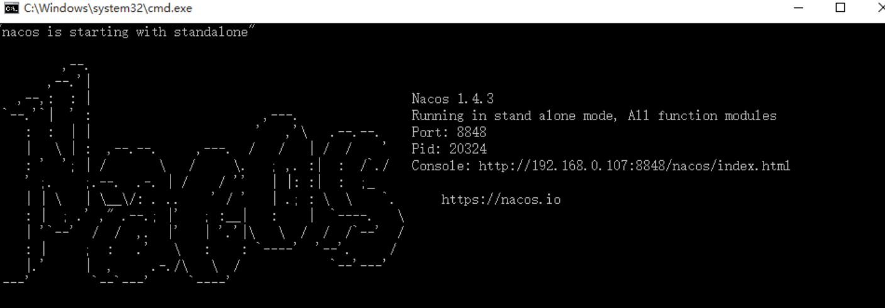

## 1.Dubbo 简介

Apache Dubbo 是一款 RPC 服务开发框架，用于解决微服务架构下的服务治理与通信问题，官方提供了 Java、Golang 等多语言 SDK 实现。使用 Dubbo 开发的微服务原生具备相互之间的远程地址发现与通信能力， 利用 Dubbo 提供的丰富服务治理特性，可以实现诸如服务发现、负载均衡、流量调度等服务治理诉求。Dubbo 被设计为高度可扩展，用户可以方便的实现流量拦截、选址的各种定制逻辑。

Dubbo3 定义为面向云原生的下一代 RPC 服务框架。3.0 基于 Dubbo 2.x 演进而来，在保持原有核心功能特性的同时， Dubbo3 在易用性、超大规模微服务实践、云原生基础设施适配、安全性等几大方向上进行了全面升级。

## 2.Dubbo 基本工作流程


Dubbo 首先是一款 RPC 框架，它定义了自己的 RPC 通信协议与编程方式。如上图所示，用户在使用 Dubbo 时首先需要定义好 Dubbo 服务；其次，是在将 Dubbo 服务部署上线之后，依赖 Dubbo 的应用层通信协议实现数据交换，Dubbo 所传输的数据都要经过序列化，而这里的序列化协议是完全可扩展的。 使用 Dubbo 的第一步就是定义 Dubbo 服务，服务在 Dubbo 中的定义就是完成业务功能的一组方法的集合，可以选择使用与某种语言绑定的方式定义，如在 Java 中 Dubbo 服务就是有一组方法的 Interface 接口，也可以使用语言中立的 Protobuf Buffers [IDL 定义服务](https://cn.dubbo.apache.org/zh/overview/tasks/triple/idl/)。定义好服务之后，服务端（Provider）需要提供服务的具体实现，并将其声明为 Dubbo 服务，而站在服务消费方（Consumer）的视角，通过调用 Dubbo 框架提供的 API 可以获得一个服务代理（stub）对象，然后就可以像使用本地服务一样对服务方法发起调用了。 在消费端对服务方法发起调用后，Dubbo 框架负责将请求发送到部署在远端机器上的服务提供方，提供方收到请求后会调用服务的实现类，之后将处理结果返回给消费端，这样就完成了一次完整的服务调用。如图中的 Request、Response 数据流程所示。

> 需要注意的是，在 Dubbo 中，我们提到服务时，通常是指 RPC 粒度的、提供某个具体业务增删改功能的接口或方法，与一些微服务概念书籍中泛指的服务并不是一个概念。

在分布式系统中，尤其是随着微服务架构的发展，应用的部署、发布、扩缩容变得极为频繁，作为 RPC 消费方，如何动态的发现服务提供方地址成为 RPC 通信的前置条件。Dubbo 提供了自动的地址发现机制，用于应对分布式场景下机器实例动态迁移的问题。如下图所示，通过引入注册中心来协调提供方与消费方的地址，提供者启动之后向注册中心注册自身地址，消费方通过拉取或订阅注册中心特定节点，动态的感知提供方地址列表的变化。


## 3.Dubbo 核心特性

### 高性能 RPC 通信协议

跨进程或主机的服务通信是 Dubbo 的一项基本能力，Dubbo RPC 以预先定义好的协议编码方式将请求数据（Request）发送给后端服务，并接收服务端返回的计算结果（Response）。RPC 通信对用户来说是完全透明的，使用者无需关心请求是如何发出去的、发到了哪里，每次调用只需要拿到正确的调用结果就行。除了同步模式的 Request-Response 通信模型外，Dubbo3 还提供更丰富的通信模型选择：

- 消费端异步请求(Client Side Asynchronous Request-Response)
- 提供端异步执行（Server Side Asynchronous Request-Response）
- 消费端请求流（Request Streaming）
- 提供端响应流（Response Streaming）
- 双向流式通信（Bidirectional Streaming）

具体可参见各语言 SDK 实现的可选协议列表 或 [Triple协议](https://cn.dubbo.apache.org/zh/docs3-v2/java-sdk/concepts-and-architecture/triple/)

#### 自动服务（地址）发现

Dubbo 的服务发现机制，让微服务组件之间可以独立演进并任意部署，消费端可以在无需感知对端部署位置与 IP 地址的情况下完成通信。Dubbo 提供的是 Client-Based 的服务发现机制，使用者可以有多种方式启用服务发现：

- 使用独立的注册中心组件，如 [Nacos](https://nacos.io/)、Zookeeper、Consul、Etcd 等。
- 将服务的组织与注册交给底层容器平台，如 Kubernetes，这被理解是一种更云原生的使用方式

### 运行态流量管控

透明地址发现让 Dubbo 请求可以被发送到任意 IP 实例上，这个过程中流量被随机分配。当需要对流量进行更丰富、更细粒度的管控时，就可以用到 Dubbo 的流量管控策略，Dubbo 提供了包括负载均衡、流量路由、请求超时、流量降级、重试等策略，基于这些基础能力可以轻松的实现更多场景化的路由方案，包括金丝雀发布、A/B测试、权重路由、同区域优先等，更酷的是，Dubbo 支持流控策略在运行态动态生效，无需重新部署。具体可参见：

- [流量治理示例](https://cn.dubbo.apache.org/zh/overview/tasks/traffic-management)

### 丰富的扩展组件及生态

Dubbo 强大的服务治理能力不仅体现在核心框架上，还包括其优秀的扩展能力以及周边配套设施的支持。

### 面向云原生设计

Dubbo 从设计上是完全遵循云原生微服务开发理念的，这体现在多个方面，首先是对云原生基础设施与部署架构的支持，包括 容器、Kubernetes 等，Dubbo Mesh 总体解决方案也在 3.1 版本正式发布；另一方面，Dubbo 众多核心组件都已面向云原生升级，包括 Triple 协议、统一路由规则、对多语言的支持。

## 4.Springboot+Dubbo+Nacos开发实战

### dubbo相关概念


> 节点说明

| 节点      | 角色说明                               |
| --------- | -------------------------------------- |
| Provider  | 暴露服务的服务提供方                   |
| Consumer  | 调用远程服务的服务消费方               |
| Registry  | 服务注册与发现的注册中心               |
| Monitor   | 统计服务的调用次数和调用时间的监控中心 |
| Container | 服务运行容器                           |

> 调用关系说明

1.服务容器负责启动，加载，运行服务提供者。
2.服务提供者在启动时，向注册中心注册自己提供的服务。
3.服务消费者在启动时，向注册中心订阅自己所需的服务。
4.注册中心返回服务提供者地址列表给消费者，如果有变更，注册中心将基于长连接推送变更数据给消费者。
5.服务消费者，从提供者地址列表中，基于软负载均衡算法，选一台提供者进行调用，如果调用失败，再选另一台调用。
6.服务消费者和提供者，在内存中累计调用次数和调用时间，定时每分钟发送一次统计数据到监控中心。

### Nacos环境准备

启动Nacos

startup.cmd -m standalone



### Nacos与dubbo整合

### 版本依赖关系

https://github.com/alibaba/spring-cloud-alibaba/wiki/%E7%89%88%E6%9C%AC%E8%AF%B4%E6%98%8E

> 为了后续方便使用SpringCloud Alibaba进行开发, 首先创建一个pom类型的父项目, 主要用于项目技术栈版本管理, 创建一个maven项目,名称为spring-cloud-alibaba-example, 去除src文件, 修改pom文件

```xml
<?xml version="1.0" encoding="UTF-8"?>
<project xmlns="http://maven.apache.org/POM/4.0.0"
         xmlns:xsi="http://www.w3.org/2001/XMLSchema-instance"
         xsi:schemaLocation="http://maven.apache.org/POM/4.0.0 http://maven.apache.org/xsd/maven-4.0.0.xsd">
    <modelVersion>4.0.0</modelVersion>

    <groupId>ah.wideth</groupId>
    <artifactId>spring-cloud-alibaba-example</artifactId>
    <version>1.0-SNAPSHOT</version>

    <parent>
        <groupId>org.springframework.boot</groupId>
        <artifactId>spring-boot-starter-parent</artifactId>
        <version>2.3.12.RELEASE</version>
        <relativePath/> <!-- lookup parent from repository -->
    </parent>

    <packaging>pom</packaging>

    <properties>
        <project.build.sourceEncoding>UTF-8</project.build.sourceEncoding>
        <java.version>1.8</java.version>
        <spring-cloud.version>Hoxton.SR12</spring-cloud.version>
        <com-alibaba-cloud.version>2.2.7.RELEASE</com-alibaba-cloud.version>
    </properties>

    <!--对项目版本进行管理-->
    <dependencyManagement>
        <dependencies>
            <dependency>
                <groupId>org.springframework.cloud</groupId>
                <artifactId>spring-cloud-dependencies</artifactId>
                <version>${spring-cloud.version}</version>
                <type>pom</type>
                <scope>import</scope>
            </dependency>

            <dependency>
                <groupId>com.alibaba.cloud</groupId>
                <artifactId>spring-cloud-alibaba-dependencies</artifactId>
                <version>${com-alibaba-cloud.version}</version>
                <type>pom</type>
                <scope>import</scope>
            </dependency>
        </dependencies>
    </dependencyManagement>
</project>
```

> 后续创建的项目都放到此目录下, 只需要声明groupId和artifactId, 会自动引用父项目spring-cloud-alibaba-example的版本。与其说是父项目, 不如说是根项目: 因为下面每学习一个新的技术, 就会新建一个真正的父项目, 而在对应的父项目下面又会创建许多的子项目


dubbo整合nacos案例

> 本文的案例是在上文nacos开发实例的基础之上继续编写的。下面开始创建我们的项目，贴上我的目录结构。


> 模块说明

- public-api公共接口模块（接口），供服务消费者和服务提供者调用。

- dubbo-provider服务提供者模块（接口实现类），引入了public-api模块。

- dubbo-consumer服务消费者模块（controller），引入了public-api模块。

- 消费者和提供者通过公共接口模块进行rpc远程调用。

> 父工程pom文件

```xml
<?xml version="1.0" encoding="UTF-8"?>
<project xmlns="http://maven.apache.org/POM/4.0.0" xmlns:xsi="http://www.w3.org/2001/XMLSchema-instance"
         xsi:schemaLocation="http://maven.apache.org/POM/4.0.0 https://maven.apache.org/xsd/maven-4.0.0.xsd">
    <modelVersion>4.0.0</modelVersion>

    <parent>
        <artifactId>spring-cloud-alibaba-example</artifactId>
        <groupId>ah.wideth</groupId>
        <version>1.0-SNAPSHOT</version>
    </parent>

    <modules>
        <module>public-api</module>
        <module>dubbo-provider</module>
        <module>dubbo-consumer</module>
    </modules>

    <artifactId>dubbo-nacos-example</artifactId>
    <name>dubbo-nacos-example</name>
    <description>duboo与nacos整合的父工程</description>
    <packaging>pom</packaging>

    <properties>
        <java.version>1.8</java.version>
        <project.build.sourceEncoding>utf-8</project.build.sourceEncoding>
        <project.reporting.outputEncoding>UTF-8</project.reporting.outputEncoding>
        <dubbo.version>2.7.13</dubbo.version>
        <nacos.version>1.4.1</nacos.version>
    </properties>


    <dependencies>

        <dependency>
            <groupId>com.alibaba.cloud</groupId>
            <artifactId>spring-cloud-starter-alibaba-nacos-discovery</artifactId>
            <!--解决nacos-client2.0报错的问题-->
            <exclusions>
                <exclusion>
                    <artifactId>nacos-client</artifactId>
                    <groupId>com.alibaba.nacos</groupId>
                </exclusion>
            </exclusions>
        </dependency>


        <!--dubbo相关-->
        <dependency>
            <groupId>org.apache.dubbo</groupId>
            <artifactId>dubbo-spring-boot-starter</artifactId>
            <version>${dubbo.version}</version>
        </dependency>

        <dependency>
            <groupId>org.apache.dubbo</groupId>
            <artifactId>dubbo-registry-nacos</artifactId>
            <version>${dubbo.version}</version>
        </dependency>

        <dependency>
            <groupId>com.alibaba.nacos</groupId>
            <artifactId>nacos-client</artifactId>
            <version>${nacos.version}</version>
        </dependency>

        <!-- 解决dubbo2.7.13jar包冲突问题-->
        <dependency>
            <groupId>com.alibaba.spring</groupId>
            <artifactId>spring-context-support</artifactId>
            <version>1.0.11</version>
        </dependency>

        <dependency>
            <groupId>org.apache.dubbo</groupId>
            <artifactId>dubbo</artifactId>
            <version>${dubbo.version}</version>
            <exclusions>
                <exclusion>
                    <groupId>org.springframework</groupId>
                    <artifactId>spring</artifactId>
                </exclusion>
                <exclusion>
                    <groupId>javax.servlet</groupId>
                    <artifactId>servlet-api</artifactId>
                </exclusion>
                <exclusion>
                    <groupId>log4j</groupId>
                    <artifactId>log4j</artifactId>
                </exclusion>
            </exclusions>
        </dependency>
        
    </dependencies>

</project>
```


### 创建公共接口模块

> pom文件

```xml
<?xml version="1.0" encoding="UTF-8"?>
<project xmlns="http://maven.apache.org/POM/4.0.0" xmlns:xsi="http://www.w3.org/2001/XMLSchema-instance"
         xsi:schemaLocation="http://maven.apache.org/POM/4.0.0 https://maven.apache.org/xsd/maven-4.0.0.xsd">
    <modelVersion>4.0.0</modelVersion>

    <parent>
        <artifactId>dubbo-nacos-example</artifactId>
        <groupId>ah.wideth</groupId>
        <version>1.0-SNAPSHOT</version>
    </parent>

    <artifactId>public-api</artifactId>
    <name>public-api</name>
    <description>api公用接口</description>
    <packaging>jar</packaging>

    <properties>
        <java.version>1.8</java.version>
        <project.build.sourceEncoding>utf-8</project.build.sourceEncoding>
        <project.reporting.outputEncoding>UTF-8</project.reporting.outputEncoding>
    </properties>

    <dependencies>
        <dependency>
            <groupId>org.springframework.boot</groupId>
            <artifactId>spring-boot-starter-web</artifactId>
        </dependency>
    </dependencies>

    <build>
        <plugins>
            <plugin>
                <groupId>org.springframework.boot</groupId>
                <artifactId>spring-boot-maven-plugin</artifactId>
                <configuration>
                    <skip>true</skip>
                </configuration>
            </plugin>
        </plugins>
    </build>

</project>
```


> 公共接口模块里面只有一个接口，没有配置文件，打jar包(因为在实际开发中，各个模块是分隔开的，需要引入公共接口的jar包)

```java
package ah.wideth.api;

/**
 * 让生产者和服务消
 * 费者来使用这个接口
 */
public interface InfoService {

    String getInfo();
}
```


### 创建服务提供者模块

> pom文件

```xml
<?xml version="1.0" encoding="UTF-8"?>
<project xmlns="http://maven.apache.org/POM/4.0.0" xmlns:xsi="http://www.w3.org/2001/XMLSchema-instance"
         xsi:schemaLocation="http://maven.apache.org/POM/4.0.0 https://maven.apache.org/xsd/maven-4.0.0.xsd">
    <modelVersion>4.0.0</modelVersion>

    <parent>
        <artifactId>dubbo-nacos-example</artifactId>
        <groupId>ah.wideth</groupId>
        <version>1.0-SNAPSHOT</version>
    </parent>

    <artifactId>dubbo-provider</artifactId>
    <name>dubbo-provider</name>
    <description>dubbo的服务提供者模块</description>

    <properties>
        <java.version>1.8</java.version>
        <project.build.sourceEncoding>utf-8</project.build.sourceEncoding>
        <project.reporting.outputEncoding>UTF-8</project.reporting.outputEncoding>
    </properties>

    <dependencies>

        <dependency>
            <groupId>org.springframework.boot</groupId>
            <artifactId>spring-boot-starter-web</artifactId>
        </dependency>

        <!--引入公共接口模块-->
        <dependency>
            <groupId>${project.groupId}</groupId>
            <artifactId>public-api</artifactId>
            <version>${project.version}</version>
        </dependency>

    </dependencies>

    <build>
        <plugins>
            <plugin>
                <groupId>org.springframework.boot</groupId>
                <artifactId>spring-boot-maven-plugin</artifactId>
            </plugin>
        </plugins>
    </build>

</project>
```

> application.yml配置文件

```yaml
server:
  port: 8180

spring:
  application:
    name: dubbo-provider

dubbo:
  registry:
    address: nacos://127.0.0.1:8848 #注册地址
  application:
    name: dubbo-provider #应用名
  protocol:
    name: dubbo #dubbo协议
    port: 20880 #协议端口
  scan:
    base-packages: ah.wideth.impl #扫包范围
  provider:
    timeout: 30000 #超时时间
```

> 接口实现类，该类实现了上面我们在公共接口模块创建的接口

```java
package ah.wideth.impl;

import ah.wideth.api.InfoService;
import org.apache.dubbo.config.annotation.DubboService;
import org.springframework.stereotype.Component;


// dubbo提供的Service注解，用于声明对外暴露服务
// Service引入的是org.apache.dubbo.config.annotation.Service包
@Component
@DubboService
public class InfoServiceImpl implements InfoService {

    @Override
    public String getInfo() {

        return "hello，这里是dubbo-provider模块！";
    }
}
```

> 服务提供者启动类

```java
package ah.wideth;

import org.apache.dubbo.config.spring.context.annotation.EnableDubbo;
import org.springframework.boot.SpringApplication;
import org.springframework.boot.autoconfigure.SpringBootApplication;
import org.springframework.cloud.client.discovery.EnableDiscoveryClient;


@EnableDubbo
@EnableDiscoveryClient
@SpringBootApplication
public class DubboProviderApplication {

    public static void main(String[] args) {

        SpringApplication.run(DubboProviderApplication.class, args);
        System.out.println("dubbo服务提供者8180启动了");
    }

}
```

### 创建服务消费者模块

> pom文件

```xml
<?xml version="1.0" encoding="UTF-8"?>
<project xmlns="http://maven.apache.org/POM/4.0.0" xmlns:xsi="http://www.w3.org/2001/XMLSchema-instance"
         xsi:schemaLocation="http://maven.apache.org/POM/4.0.0 https://maven.apache.org/xsd/maven-4.0.0.xsd">
    <modelVersion>4.0.0</modelVersion>

    <parent>
        <artifactId>dubbo-nacos-example</artifactId>
        <groupId>ah.wideth</groupId>
        <version>1.0-SNAPSHOT</version>
    </parent>

    <artifactId>dubbo-consumer</artifactId>
    <name>dubbo-consumer</name>
    <description>dubbo的服务消费者模块</description>

    <properties>
        <java.version>1.8</java.version>
        <project.build.sourceEncoding>utf-8</project.build.sourceEncoding>
        <project.reporting.outputEncoding>UTF-8</project.reporting.outputEncoding>
    </properties>

    <dependencies>

        <dependency>
            <groupId>org.springframework.boot</groupId>
            <artifactId>spring-boot-starter-web</artifactId>
        </dependency>

        <!--引入公共接口模块-->
        <dependency>
            <groupId>${project.groupId}</groupId>
            <artifactId>public-api</artifactId>
            <version>${project.version}</version>
        </dependency>

    </dependencies>

    <build>
        <plugins>
            <plugin>
                <groupId>org.springframework.boot</groupId>
                <artifactId>spring-boot-maven-plugin</artifactId>
            </plugin>
        </plugins>

    </build>
</project>
```

> application.yml配置文件

```yaml
server:
  port: 8181

spring:
  application:
    name: dubbo-consumer

dubbo:
  registry:
    address: nacos://127.0.0.1:8848 #注册地址
  application:
    name: dubbo-consumer #应用名
  consumer:
    timeout: 30000 #超时时间
```

> controller，调用公共接口模块创建的接口

```java
package ah.wideth.controller;

import ah.wideth.api.InfoService;
import org.apache.dubbo.config.annotation.DubboReference;
import org.springframework.web.bind.annotation.GetMapping;
import org.springframework.web.bind.annotation.RestController;

@RestController
public class InfoController {

    //dumbo提供的Reference注解，用于调用远程服务
    @DubboReference(check = false)
    private InfoService infoService;

    @GetMapping("/getInfo")
    public String getInfo(){

        return infoService.getInfo();
    }
}
```

> 服务消费者启动类

```java
package ah.wideth;

import org.apache.dubbo.config.spring.context.annotation.EnableDubbo;
import org.springframework.boot.SpringApplication;
import org.springframework.boot.autoconfigure.SpringBootApplication;
import org.springframework.cloud.client.discovery.EnableDiscoveryClient;


@EnableDubbo
@EnableDiscoveryClient
@SpringBootApplication
public class DubboConsumerApplication {

    public static void main(String[] args) {

        SpringApplication.run(DubboConsumerApplication.class, args);
        System.out.println("dubbo服务消费者8181启动了");
    }

}
```

### 服务调用测试

> 打开Nacos控制面板查看注册中心中的服务


> 启动nacos，启动服务提供者和服务消费者，调用服务消费者的getInfo方法，服务提供者会返回结果


整合过程参考：https://blog.csdn.net/qq_31960623/article/details/123942994