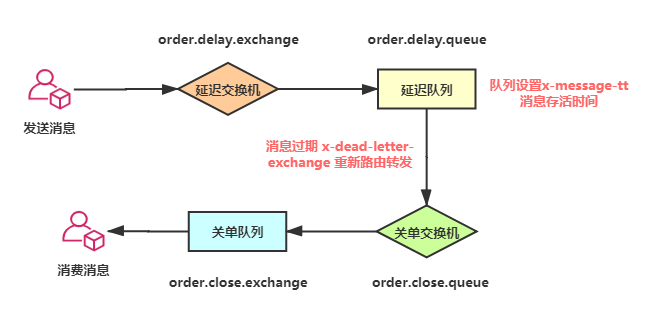

# RabbitMQ

RabbitMQ本身并不存在延迟队列的概念，在 RabbitMQ 中是通过 DLX 死信交换机和 TTL 消息过期来实现延迟队列的。

## TTL（Time to Live）过期时间

有两种方式可以设置 TTL。

1. 通过队列属性设置，这样的话队列中的所有消息都会拥有相同的过期时间
2. 对消息单独设置过期时间，这样每条消息的过期时间都可以不同

那么如果同时设置呢？这样将会以两个时间中较小的值为准

针对队列的方式通过参数`x-message-ttl`来设置。

```java
Map<String, Object> args = new HashMap<String, Object>();
args.put("x-message-ttl", 6000);
channel.queueDeclare(queueName, durable, exclusive, autoDelete, args);
```

针对消息的方式通过`setExpiration`来设置。

```java
AMQP.BasicProperties properties = new AMQP.BasicProperties();
Properties.setDeliveryMode(2);
properties.setExpiration("60000");
channel.basicPublish(exchangeName, routingKey, mandatory, properties, "message".getBytes());
```

## DLX（Dead Letter Exchange）死信交换机

一个消息要成为死信消息有 3 种情况：

1. 消息被拒绝，比如调用`reject`方法，并且需要设置`requeue`为`false`
2. 消息过期
3. 队列达到最大长度

## 原理



# RocketMQ

RocketMQ 和 RabbitMQ 不同，它本身就有延迟队列的功能，但是开源版本只能支持固定延迟时间的消息，不支持任意时间精度的消息（这个好像只有阿里云版本的可以）。

他的默认时间间隔分为 18 个级别，基本上也能满足大部分场景的需要了。

默认延迟级别：1s、 5s、 10s、 30s、 1m、 2m、 3m、 4m、 5m、 6m、 7m、 8m、 9m、 10m、 20m、 30m、 1h、 2h。

使用起来也非常的简单，直接通过`setDelayTimeLevel`设置延迟级别即可。

```java
setDelayTimeLevel(level)
```

