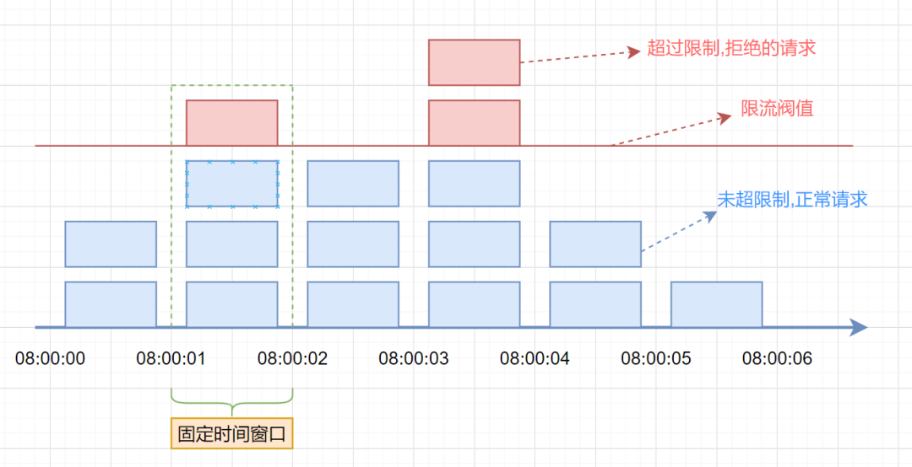
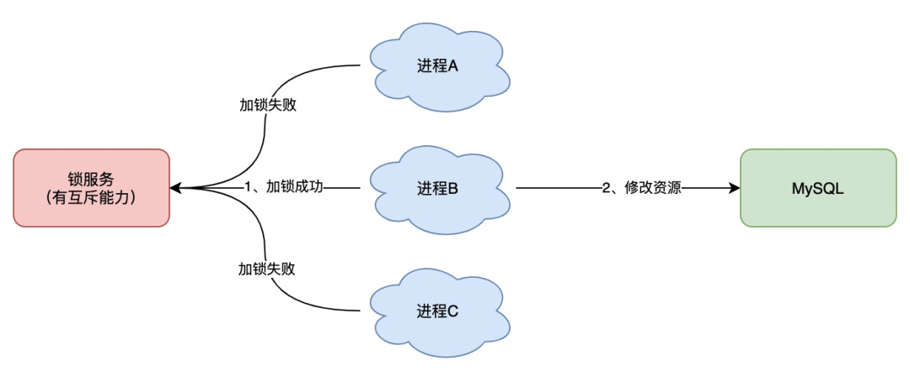
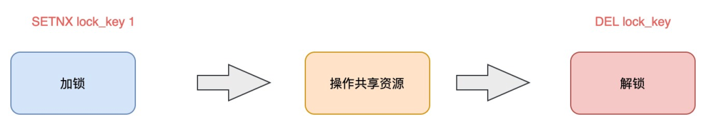
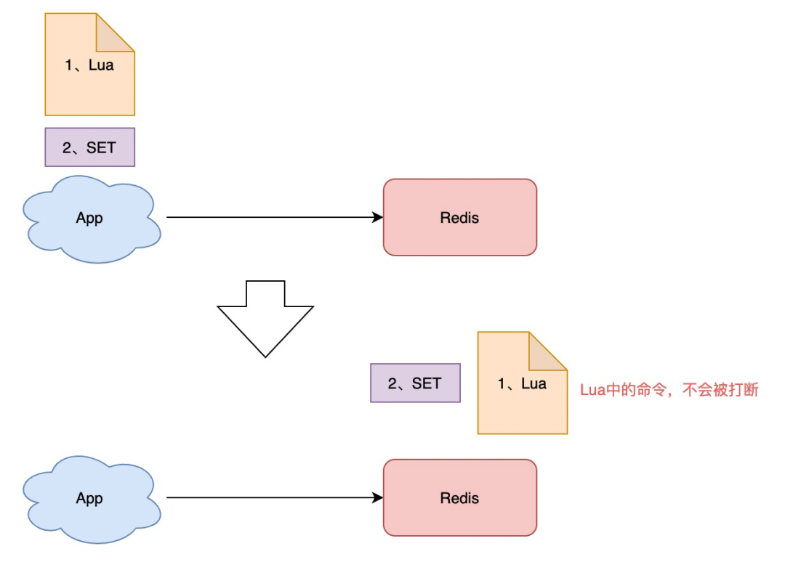
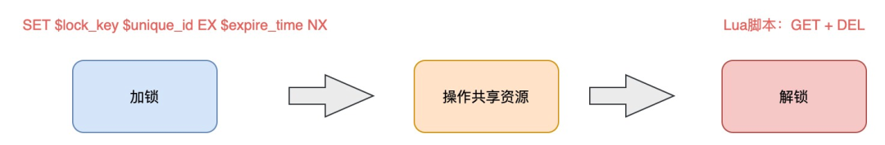
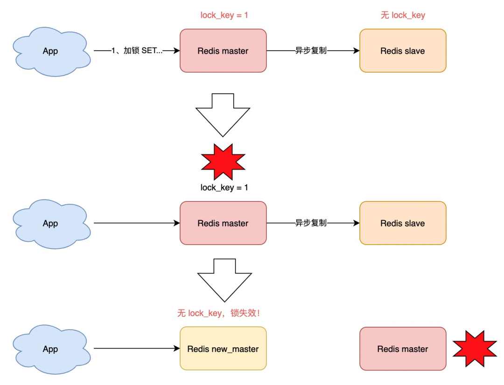
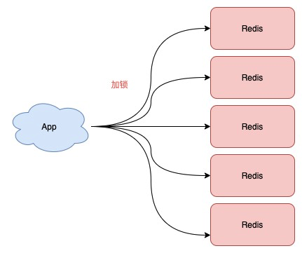

下面这些问题，你能清晰地回答上来吗？

- 基于 Redis 如何实现一个分布式锁？
- Redis 分布式锁真的安全吗？
- Redis 的 Redlock 有什么问题？一定安全吗？
- 业界争论 Redlock，到底在争论什么？哪种观点是对的？
- 分布式锁到底用 Redis 还是 Zookeeper？
- 实现一个有「容错性」的分布式锁，都需要考虑哪些问题？

这篇文章，我就来把这些问题彻底讲清楚。

读完这篇文章，你不仅可以彻底了解分布式锁，还会对「分布式系统」有更加深刻的理解。



# 一、为什么需要分布式锁？

在开始讲分布式锁之前，有必要简单介绍一下，为什么需要分布式锁？

与分布式锁相对应的是「单机锁」，我们在写多线程程序时，避免同时操作一个共享变量产生数据问题，通常会使用一把锁来「互斥」，以保证共享变量的正确性，其使用范围是在「同一个进程」中。

如果换做是多个进程，需要同时操作一个共享资源，如何互斥呢？

例如，现在的业务应用通常都是微服务架构，这也意味着一个应用会部署多个进程，那这多个进程如果需要修改 MySQL 中的同一行记录时，为了避免操作乱序导致数据错误，此时，我们就需要引入「分布式锁」来解决这个问题了。



想要实现分布式锁，必须借助一个外部系统，所有进程都去这个系统上申请「加锁」。

而这个外部系统，必须要实现「互斥」的能力，即两个请求同时进来，只会给一个进程返回成功，另一个返回失败（或等待）。

这个外部系统，可以是 MySQL，也可以是 Redis 或 Zookeeper。但为了追求更好的性能，我们通常会选择使用 Redis 或 Zookeeper 来做。

下面我就以 Redis 为主线，由浅入深，带你深度剖析一下，分布式锁的各种「安全性」问题，帮你彻底理解分布式锁。

# 二、分布式锁怎么实现？

我们从最简单的开始讲起。

想要实现分布式锁，必须要求 Redis 有「互斥」的能力，我们可以使用 SETNX 命令，这个命令表示**SET** if **N**ot e**X**ists，即如果 key 不存在，才会设置它的值，否则什么也不做。

两个客户端进程可以执行这个命令，达到互斥，就可以实现一个分布式锁。

客户端 1 申请加锁，加锁成功：

```sh
127.0.0.1:6379> SETNX lock 1
(integer) 1     // 客户端1，加锁成功
```

客户端 2 申请加锁，因为它后到达，加锁失败：

```sh
127.0.0.1:6379> SETNX lock 1
(integer) 0     // 客户端2，加锁失败
```

此时，加锁成功的客户端，就可以去操作「共享资源」，例如，修改 MySQL 的某一行数据，或者调用一个 API 请求。

操作完成后，还要及时释放锁，给后来者让出操作共享资源的机会。如何释放锁呢？

也很简单，直接使用 DEL 命令删除这个 key 即可：

```sh
127.0.0.1:6379> DEL lock // 释放锁
(integer) 1
```

这个逻辑非常简单，整体的路程就是这样：



但是，它存在一个很大的问题，当客户端 1 拿到锁后，如果发生下面的场景，就会造成「死锁」：

1. 程序处理业务逻辑异常，没及时释放锁
2. 进程挂了，没机会释放锁

这时，这个客户端就会一直占用这个锁，而其它客户端就「永远」拿不到这把锁了。

怎么解决这个问题呢？

# 三、如何避免死锁？

我们很容易想到的方案是，在申请锁时，给这把锁设置一个「租期」。

在 Redis 中实现时，就是给这个 key 设置一个「过期时间」。这里我们假设，操作共享资源的时间不会超过 10s，那么在加锁时，给这个 key 设置 10s 过期即可：

```sh
127.0.0.1:6379> SETNX lock 1    // 加锁
(integer) 1
127.0.0.1:6379> EXPIRE lock 10  // 10s后自动过期
(integer) 1
```

这样一来，无论客户端是否异常，这个锁都可以在 10s 后被「自动释放」，其它客户端依旧可以拿到锁。

但这样真的没问题吗？

还是有问题。

现在的操作，加锁、设置过期是 2 条命令，有没有可能只执行了第一条，第二条却「来不及」执行的情况发生呢？例如：

1. SETNX 执行成功，执行 EXPIRE 时由于网络问题，执行失败
2. SETNX 执行成功，Redis 异常宕机，EXPIRE 没有机会执行
3. SETNX 执行成功，客户端异常崩溃，EXPIRE 也没有机会执行

总之，这两条命令不能保证是原子操作（一起成功），就有潜在的风险导致过期时间设置失败，依旧发生「死锁」问题。

怎么办？

在 Redis 2.6.12 版本之前，我们需要想尽办法，保证 SETNX 和 EXPIRE 原子性执行，还要考虑各种异常情况如何处理。

但在 Redis 2.6.12 之后，Redis 扩展了 SET 命令的参数，用这一条命令就可以了：

```sh
// 一条命令保证原子性执行
127.0.0.1:6379> SET lock 1 EX 10 NX
OK
```

这样就解决了死锁问题，也比较简单。

我们再来看分析下，它还有什么问题？

试想这样一种场景：

1. 客户端 1 加锁成功，开始操作共享资源
2. 客户端 1 操作共享资源的时间，「超过」了锁的过期时间，锁被「自动释放」
3. 客户端 2 加锁成功，开始操作共享资源
4. 客户端 1 操作共享资源完成，释放锁（但释放的是客户端 2 的锁）

看到了么，这里存在两个严重的问题：

1. **锁过期**：客户端 1 操作共享资源耗时太久，导致锁被自动释放，之后被客户端 2 持有
2. **释放别人的锁**：客户端 1 操作共享资源完成后，却又释放了客户端 2 的锁

导致这两个问题的原因是什么？我们一个个来看。

#### 第一个问题，可能是我们评估操作共享资源的时间不准确导致的。

例如，操作共享资源的时间「最慢」可能需要 15s，而我们却只设置了 10s 过期，那这就存在锁提前过期的风险。

过期时间太短，那增大冗余时间，例如设置过期时间为 20s，这样总可以了吧？

这样确实可以「缓解」这个问题，降低出问题的概率，但依旧无法「彻底解决」问题。

为什么？

原因在于，客户端在拿到锁之后，在操作共享资源时，遇到的场景有可能是很复杂的，例如，程序内部发生异常、网络请求超时等等。

既然是「预估」时间，也只能是大致计算，除非你能预料并覆盖到所有导致耗时变长的场景，但这其实很难。

有什么更好的解决方案吗？

别急，关于这个问题，我会在后面详细来讲对应的解决方案。

我们继续来看第二个问题。

#### 第二个问题在于，一个客户端释放了其它客户端持有的锁。

想一下，导致这个问题的关键点在哪？

重点在于，每个客户端在释放锁时，都是「无脑」操作，并没有检查这把锁是否还「归自己持有」，所以就会发生释放别人锁的风险，这样的解锁流程，很不「严谨」！

如何解决这个问题呢？

# 四、锁被别人释放怎么办?

解决办法是：客户端在加锁时，设置一个只有自己知道的「唯一标识」进去。

例如，可以是自己的线程 ID，也可以是一个 UUID（随机且唯一），这里我们以 UUID 举例：

```sh
// 锁的VALUE设置为UUID
127.0.0.1:6379> SET lock $uuid EX 20 NX
OK
```

> 这里假设 20s 操作共享时间完全足够，先不考虑锁自动过期的问题。

之后，在释放锁时，要先判断这把锁是否还归自己持有，伪代码可以这么写：

```sh
// 锁是自己的，才释放
if redis.get("lock") == $uuid:
    redis.del("lock")
```

这里释放锁使用的是 GET + DEL 两条命令，这时，又会遇到我们前面讲的原子性问题了。

1. 客户端 1 执行 GET，判断锁是自己的
2. 客户端 2 执行了 SET 命令，强制获取到锁（虽然发生概率比较低，但我们需要严谨地考虑锁的安全性模型）
3. 客户端 1 执行 DEL，却释放了客户端 2 的锁

由此可见，这两个命令还是必须要原子执行才行。

怎样原子执行呢？Lua 脚本。

我们可以把这个逻辑，写成 Lua 脚本，让 Redis 来执行。

因为 Redis 处理每一个请求是「单线程」执行的，在执行一个 Lua 脚本时，其它请求必须等待，直到这个 Lua 脚本处理完成，这样一来，GET + DEL 之间就不会插入其它命令了。



安全释放锁的 Lua 脚本如下：

```sh
// 判断锁是自己的，才释放
if redis.call("GET",KEYS[1]) == ARGV[1]
then
    return redis.call("DEL",KEYS[1])
else
    return 0
end
```

好了，这样一路优化，整个的加锁、解锁的流程就更「严谨」了。

这里我们先小结一下，基于 Redis 实现的分布式锁，一个严谨的的流程如下：

1. 加锁：SET lock_key $unique_id EX $expire_time NX
2. 操作共享资源
3. 释放锁：Lua 脚本，先 GET 判断锁是否归属自己，再 DEL 释放锁



好，有了这个完整的锁模型，让我们重新回到前面提到的第一个问题。

锁过期时间不好评估怎么办？

# 五、锁过期时间不好评估怎么办？

前面我们提到，锁的过期时间如果评估不好，这个锁就会有「提前」过期的风险。

当时给的妥协方案是，尽量「冗余」过期时间，降低锁提前过期的概率。

这个方案其实也不能完美解决问题，那怎么办呢？

是否可以设计这样的方案：**加锁时，先设置一个过期时间，然后我们开启一个「守护线程」，定时去检测这个锁的失效时间，如果锁快要过期了，操作共享资源还未完成，那么就自动对锁进行「续期」，重新设置过期时间。**

这确实一种比较好的方案。

如果你是 Java 技术栈，幸运的是，已经有一个库把这些工作都封装好了：**Redisson**。

Redisson 是一个 Java 语言实现的 Redis SDK 客户端，在使用分布式锁时，它就采用了「自动续期」的方案来避免锁过期，这个守护线程我们一般也把它叫做「看门狗」线程。


除此之外，这个 SDK 还封装了很多易用的功能：

- 可重入锁
- 乐观锁
- 公平锁
- 读写锁
- Redlock（红锁，下面会详细讲）

这个 SDK 提供的 API 非常友好，它可以像操作本地锁的方式，操作分布式锁。如果你是 Java 技术栈，可以直接把它用起来。

> 这里不重点介绍 Redisson 的使用，大家可以看官方 Github 学习如何使用，比较简单。

到这里我们再小结一下，基于 Redis 的实现分布式锁，前面遇到的问题，以及对应的解决方案：

- **死锁**：设置过期时间
- **过期时间评估不好，锁提前过期**：守护线程，自动续期
- **锁被别人释放**：锁写入唯一标识，释放锁先检查标识，再释放

还有哪些问题场景，会危害 Redis 锁的安全性呢？

之前分析的场景都是，锁在「单个」Redis 实例中可能产生的问题，并没有涉及到 Redis 的部署架构细节。

而我们在使用 Redis 时，一般会采用**主从集群 + 哨兵**的模式部署，这样做的好处在于，当主库异常宕机时，哨兵可以实现「故障自动切换」，把从库提升为主库，继续提供服务，以此保证可用性。

**那当「主从发生切换」时，这个分布锁会依旧安全吗？**

试想这样的场景：

1. 客户端 1 在主库上执行 SET 命令，加锁成功
2. 此时，主库异常宕机，SET 命令还未同步到从库上（主从复制是异步的）
3. 从库被哨兵提升为新主库，这个锁在新的主库上，丢失了！



可见，当引入 Redis 副本后，分布锁还是可能会受到影响。

怎么解决这个问题？

为此，Redis 的作者提出一种解决方案，就是我们经常听到的 **Redlock（红锁）**。

它真的可以解决上面这个问题吗？

# 六、Redlock 真的安全吗？

现在我们来看，Redis 作者提出的 Redlock 方案，是如何解决主从切换后，锁失效问题的。

Redlock 的方案基于 2 个前提：

1. 不再需要部署**从库**和**哨兵**实例，只部署**主库**
2. 但主库要部署多个，官方推荐至少 5 个实例

也就是说，想用使用 Redlock，你至少要部署 5 个 Redis 实例，而且都是主库，它们之间没有任何关系，都是一个个孤立的实例。



Redlock 具体如何使用呢？