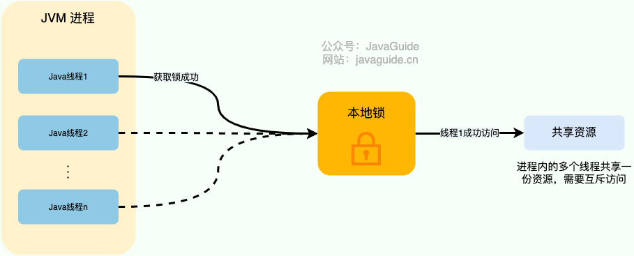

# 一、什么是分布式锁？

对于单机多线程来说，在 Java 中，我们通常使用 `ReetrantLock` 类、`synchronized` 关键字这类 JDK 自带的 **本地锁** 来控制一个 JVM 进程内的多个线程对本地共享资源的访问。

下面是我对本地锁画的一张示意图。



从图中可以看出，这些线程访问共享资源是互斥的，同一时刻只有一个线程可以获取到本地锁访问共享资源。

分布式系统下，不同的服务/客户端通常运行在独立的 JVM 进程上。如果多个 JVM 进程共享同一份资源的话，使用本地锁就没办法实现资源的互斥访问了。于是，**分布式锁** 就诞生了。

举个例子：系统的订单服务一共部署了 3 份，都对外提供服务。用户下订单之前需要检查库存，为了防止超卖，这里需要加锁以实现对检查库存操作的同步访问。由于订单服务位于不同的 JVM 进程中，本地锁在这种情况下就没办法正常工作了。我们需要用到分布式锁，这样的话，即使多个线程不在同一个 JVM 进程中也能获取到同一把锁，进而实现共享资源的互斥访问。

下面是我对分布式锁画的一张示意图。


从图中可以看出，这些独立的进程中的线程访问共享资源是互斥的，同一时刻只有一个线程可以获取到分布式锁访问共享资源。

一个最基本的分布式锁需要满足：

- **互斥** ：任意一个时刻，锁只能被一个线程持有；
- **高可用** ：锁服务是高可用的。并且，即使客户端的释放锁的代码逻辑出现问题，锁最终一定还是会被释放，不会影响其他线程对共享资源的访问。
- **可重入**：一个节点获取了锁之后，还可以再次获取锁。

通常情况下，我们一般会选择基于 Redis 或者 ZooKeeper 实现分布式锁，Redis 用的要更多一点，我这里也以 Redis 为例介绍分布式锁的实现。

# 二、基于 Redis 实现分布式锁

### 如何基于 Redis 实现一个最简易的分布式锁？

在 Redis 中， `SETNX` 命令是可以帮助我们实现互斥。`SETNX` 即 **SET** if **N**ot e**X**ists (对应 Java 中的 `setIfAbsent` 方法)，如果 key 不存在的话，才会设置 key 的值。如果 key 已经存在， `SETNX` 啥也不做。

```sh
> SETNX lockKey uniqueValue
(integer) 1
> SETNX lockKey uniqueValue
(integer) 0
```

释放锁的话，直接通过 `DEL` 命令删除对应的 key 即可。

```bash
> DEL lockKey
(integer) 1
```