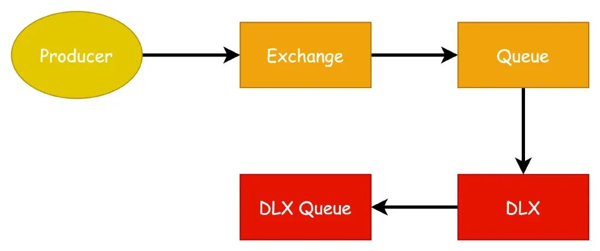

电商领域的技术架构有哪些常见问题？

### 一、避免重复下单

用户快速点了两次 “提交订单”  按钮，浏览器会向后端发送两条创建订单的请求，最终会创建两条一模一样的订单。

**解决方案：**

解决方案就是采用**幂等机制**，多次请求和一次请求产生的效果是一样的。

**方案一：**

利用数据库自身特性 “主键唯一约束”，在插入订单记录时，带上主键值，如果订单重复，记录插入会失败。

操作过程：

- 引入一个服务，用于生成一个“全局唯一的订单号”
- 进入创建订单页面时，前端请求该服务，预生成订单ID
- 提交订单时，请求参数除了业务参数外，还要带上这个预生成订单ID

**方案二：**

前端通过js脚本控制，无法解决用户刷新提交的请求。另外也无法解决恶意提交。

不建议采用该方案，如果想用，也只是作为一个补充方案。

**方案三：**

前后约定附加参数校验。

当用户点击购买按钮时，渲染下单页面，展示商品、收货地址、运费、价格等信息，同时页面会埋上`Token `信息，用户提交订单时，后端业务逻辑会校验token，有且匹配才认为是合理请求。

注意：同一个 `Token` 只能用一次，用完后立马失效掉。

**补充：**

关于幂等的处理，更多解决方案可以看这两篇文章

- **[高并发下如何保证接口的幂等性？](https://mp.weixin.qq.com/s?__biz=Mzg2NzYyNjQzNg==&mid=2247485064&idx=1&sn=0596c89178b7c67c92bfaaf4e44a3b1d&scene=21#wechat_redirect)**
- **[幂等设计，都有哪些技术方案？](https://mp.weixin.qq.com/s?__biz=Mzg2NzYyNjQzNg==&mid=2247489368&idx=1&sn=428dc07c9e788d217d2e357933cb8bc4&scene=21#wechat_redirect)**

### 二、订单快照，减少存储成本